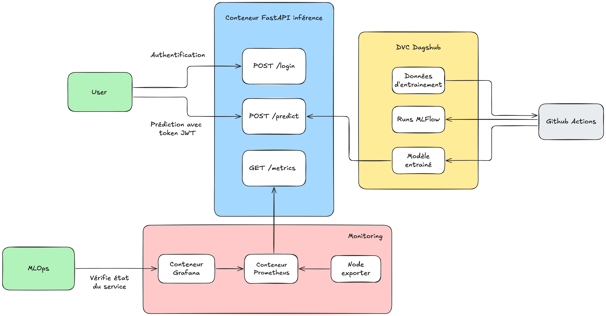

Projet Trafic Cycliste
======================

Ce projet vise à développer un outil prédictif du trafic cycliste à Paris, en exploitant les données historiques des compteurs vélo pour anticiper les flux à un lieu et moment spécifiques (jour de la semaine, heure de la journée, mois).

Streamlit
---------

Pour lancer le streamlit:

```shell
streamlit run streamlit_app.py
```

Diagramme d'architecture du projet
----------------------------------



Service FastAPI et Docker Compose
---------------------------------

> [!IMPORTANT]
> Afin de pouvoir lancer le service FastAPI, il est nécessaire de télécharger les données et le model avec `dvc pull`
> ou de suivre les étapes de préprocessing des données et d'entraînement du modèle.

Pour lancer le service FastAPI avec Docker, il faut d'abord construire l'image Docker avec la commande :

```shell
docker compose build
```

Puis les services peuvent être lancés avec :

```shell
docker compose up -d
```

Les services suivants seront lancés :

- Service FastAPI de prédiction accessible sur le port 8000
- Service Prometheus sur le port 9090
- Service Node Exporter sur le port 9110
- Service Alert Manager sur le port 9093
- Service Grafana sur le port 3000

### POST /login

Renvoie un JWT access token (Username: alice, password: password) à fournir pour les autres APIs.

```bash
curl --request POST \
  --url http://localhost:8000/login \
  --header 'content-type: multipart/form-data' \
  --form username=alice \
  --form password=password

{"access_token": <access_token>, "token_type": "bearer"}
```

### POST /predict

Renvoie une prédiction pour un lieu de comptage et une heure précise

#### Corps de la requête

```json
{
  "jour": 24,
  "mois": 12,
  "annee": 2025,
  "heure": 8,
  "jour_semaine": 2,
  "jour_ferie": false,
  "vacances_scolaires": true,
  "site_comptage": "Pont des Invalides"
}
```

#### Paramètres

- `jour`: Jour du mois (1-31)
- `mois`: Mois (1-12)
- `annee`: Année (2024)
- `heure`: Heure (0-23)
- `jour_semaine`: Jour de la semaine (0=Lundi, 6=Dimanche)
- `jour_ferie`: Si c'est un jour férié (true/false)
- `vacances_scolaires`: Si le jour est pendant les vacances scolaires (true/false)
- `site_comptage`: Nom du site de comptage

#### Réponse

```json
{
  "prediction": 62.049917385050854,
  "input_parameters": {
    "jour": 24,
    "mois": 12,
    "annee": 2025,
    "heure": 8,
    "jour_semaine": 2,
    "jour_ferie": false,
    "vacances_scolaires": true,
    "site_comptage": "Pont des Invalides"
  }
}
```

### Test de l'API

Avec curl:

```bash
# Récupération du token
curl --request POST \
  --url http://localhost:8000/login \
  --header 'content-type: multipart/form-data' \
  --form username=alice \
  --form password=password

# Prédiction
curl --request POST \
  --url http://localhost:8000/predict \
  --header 'content-type: application/json' \
  --header 'Authorization: Bearer <token>' \
  --data '{
    "jour": 24,
    "mois": 12,
    "annee": 2025,
    "heure": 8,
    "jour_semaine": 2,
    "jour_ferie": false,
    "vacances_scolaires": true,
    "site_comptage": "Pont des Invalides"
}'
```

Avec Python requests:

```python
import requests

API_URL = "http://localhost:8000"

payload = {
    "jour": 24,
    "mois": 12,
    "annee": 2025,
    "heure": 8,
    "jour_semaine": 2,
    "jour_ferie": False,
    "vacances_scolaires": True,
    "site_comptage": "Pont des Invalides"
}

response = requests.post(
    f"{API_URL}/login",
    data={"username": "alice", "password": "password"}
)

if response.status_code == 200:
    token = response.json().get("access_token")

headers = {"Authorization": f"Bearer {token}"}

response = requests.post(f"{API_URL}/predict", json=payload, headers=headers)

print(response.json())
```

Organisation du projet
----------------------

<details>

<summary>Hiérarchie des fichiers du projet</summary>

    ├── LICENSE
    ├── README.md          <- The top-level README for developers using this project.
    ├── data
    │   ├── processed      <- The final, canonical data sets for modeling.
    │   └── raw            <- The original, immutable data dump.
    ├── docker             <- Configuration files for Docker compose services (Prometheus, etc.)
    │
    ├── models             <- Trained and serialized models, model predictions, or model summaries
    │
    ├── notebooks          <- Jupyter notebooks. Naming convention is a number (for ordering),
    │                         the creator's name, and a short `-` delimited description, e.g.
    │                         `1.0-alban-data-exploration`.
    │
    ├── requirements.txt   <- The requirements file for reproducing the analysis environment, e.g.
    │                         generated with `pip freeze > requirements.txt`
    │
    ├── src                <- Source code for use in this project.
    │   ├── __init__.py    <- Makes src a Python module
    │   ├── service.py    <- FastAPI Python service around the model
    │   │
    │   ├── features       <- Scripts to turn raw data into features for modeling
    │   │   └── process_data.py
    │   │
    │   ├── models         <- Scripts to train models and then use trained models to make
    │   │   │                 predictions
    │   │   └── train_model.py
    ├── streamlit_assets   <- Pre-generated files for Streamlit presentation
    ├── streamlit_utils    <- Utility python files for the streamlit app
    ├── streamlit_app.py   <- Streamlit app
    ├── Dockerfile         <- Dockerfile for the FastAPI service
    ├── docker-compose.yml <- Docker compose file to start FastAPI service and monitoring services

</details>

Préprocessing des données et entraînement du modèle
---------------------------------------------------

Pour effectuer le processing des données (pour la régression), il faut d'abord télécharger les données de opendata.paris.fr (voir plus bas),
puis lancer le script suivant dans le virtualenv du projet :

```sh
python ./src/features/process_data.py
```

L'entrainement du modèle de régression pour le service FastAPI peut être effectué avec :

```sh
python ./src/models/train_model.py
```

Notebooks
---------

Plusieurs notebooks Jupyter de préprocessing des données ont été réalisés :

- [1.0_exploration_data_1.ipynb](notebooks/1.0_exploration_data_1.ipynb) et [1.0_exploration_data_2.ipynb](notebooks/1.0_exploration_data_2.ipynb) sont des notebooks d'exploration initiale des données. Les deux notebooks possèdent des diagrammes complémentaires.
- [1.5_dataviz_annees_anterieures.ipynb](notebooks/1.5_dataviz_annees_anterieures.ipynb) est un notebook d'exploration des données avant 2022. Au final nous avons seulement retenu les données de 2023 et 2024 pour la modélisation.
- [2.0_preprocessing_compteurs.ipynb](notebooks/2.0_preprocessing_compteurs.ipynb) est un notebook de préprocessing des données intégrant les données de tous les compteurs.
- [2.0_preprocessing_lieux_compteurs.ipynb](notebooks/2.0_preprocessing_lieux_compteurs.ipynb) est un notebook de préprocessing des données similaire au précédent, mais ne retenant que les lieux des compteurs pour la modélisation. C'est ce dataset qui est utilisé pour l'entrainement de la plupart des modèles.
- [2.2_convert_to_classification.ipynb](notebooks/2.2_convert_to_classification.ipynb) est un notebook de préprocessing des données utilisé pour convertir le dataset de modélisation en un dataset propre à la classification, en introduisant des classes de comptage horaire.
- [2.5_normalisation.ipynb](notebooks/2.5_normalisation.ipynb) est un notebook qui se focalise sur les étapes de normalisation des données.

Nous avons ensuite produit des notebooks pour tester différents modèles pour résoudre notre problématique de prédiction :

### Régression

- [LinearRegression](notebooks/regression/LinearRegression.ipynb)
- [Prophet](notebooks/regression/Prophet.ipynb), de part la nature du modèle, les données des compteurs sont pris séparément.
- [SVR](notebooks/regression/SVR.ipynb), l'entrainement ne finit pas, une approche en prenant les données des compteurs séparément est proposée
- [DecisionTreeRegressor](notebooks/regression/Decision_tree_regressor.ipynb)
- [SGDRegressor](notebooks/regression/SGDRegressor.ipynb)
- [XGBRegressor](notebooks/regression/XGBRegressor.ipynb)
- [LCE](notebooks/regression/lcensemble.ipynb), l'entrainement ne finit pas.
- [AdaBoostRegressor](notebooks/regression/Ada_boost_Regressor.ipynb)
- [RandomForestRegressor](notebooks/regression/RandomForestRegressor.ipynb)
- [HistGradientBoostingRegressor](notebooks/regression/HistGradientBoostingRegressor.ipynb)

### Classification

- [LogisticRegressionClass](notebooks/classification/LogisticRegressionClass.ipynb)
- [DecisionTreeClassifier](notebooks/classification/DecisionTreeClassifier.ipynb)
- [SVC](notebooks/classification/SVC.ipynb)
- [KNNClassifier](notebooks/classification/KNNClassifier.ipynb), scoring et prédiction extrêmement longues
- [SGDClassifier](notebooks/classification/SGDClassifier.ipynb)
- [XGBClassifier](notebooks/classification/XGBClassifier.ipynb)
- [HistGradientBoostingClassifier](notebooks/classification/HistGradientBoostingClassifier.ipynb)
- [RandomForestClassifier](notebooks/classification/RandomForestClassifier.ipynb)

Pour certains modèles (XGBoost, lcensemble et prophet), des fichiers requirements.txt spécifiques sont disponibles dans le dossier `requirements`, afin d'éviter des problèmes de compatibilités liés aux versions de numpy utilisés.

Sources du dataset
------------------

Les datasets utilisés pour ce projet sont librement accessibles sur le site https://opendata.paris.fr :

- [2024-2025](https://opendata.paris.fr/api/explore/v2.1/catalog/datasets/comptage-velo-donnees-compteurs/exports/csv?lang=fr&timezone=Europe%2FParis&use_labels=true&delimiter=%3B) (ce dataset étant mis à jour quotidiennement, pour la reproduction des résultats, nous avons utilisé ce [snapshot datant du mois de février](https://drive.google.com/file/d/17slwIHCmPh9_8YTeEv4pLJ3bErfAZBp0/view?usp=drive_link))
- [2023](https://opendata.paris.fr/api/datasets/1.0/comptage-velo-historique-donnees-compteurs/attachments/2023_comptage_velo_donnees_compteurs_zip/)

Les datasets suivants sont seulement utilisés pour [1.5_dataviz_annees_anterieures.ipynb](notebooks/1.5_dataviz_annees_anterieures.ipynb) :

- [2018](https://opendata.paris.fr/api/datasets/1.0/comptage-velo-historique-donnees-compteurs/attachments/2018_comptage_velo_donnees_compteurs_csv_zip/)
- [2019](https://opendata.paris.fr/api/datasets/1.0/comptage-velo-historique-donnees-compteurs/attachments/2019_comptage_velo_donnees_compteurs_csv_zip/)

Une archive ZIP avec les datasets pré et post processing est disponible : [data_jan25_bds_trafic_cycliste.zip](https://drive.google.com/file/d/1KGefd6n7SmDHToVcVNGkKb6GjAZQvFUz/view?usp=sharing)

--------

<p><small>Projet basé sur le <a target="_blank" href="https://drivendata.github.io/cookiecutter-data-science/">template cookiecutter data science project</a>. #cookiecutterdatascience</small></p>
